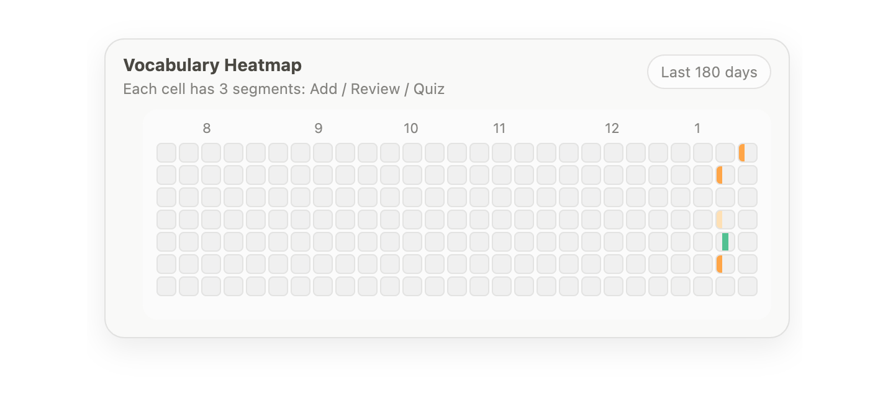
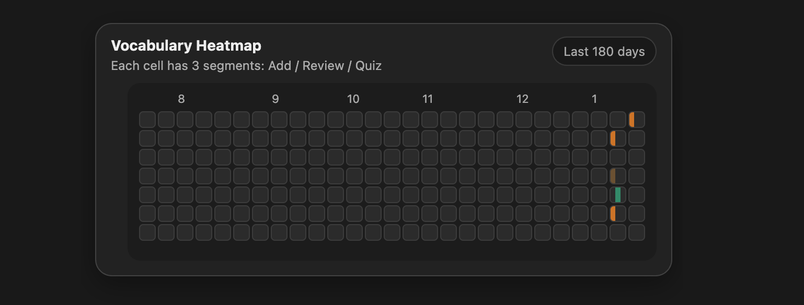

# 📊 Vocabulary Learning Heatmap
[English](README.md) | [中文说明](README.zh-CN.md)

A visual dashboard for tracking daily vocabulary learning activity, inspired by GitHub-style contribution heatmaps.

## 🎨 Preview

| Light mode | Dark mode |
|-----------|-----------|
|  |  |

This heatmap is designed to work with **Notion-based vocabulary systems** and provides a quick overview of learning consistency over time.

---

## ✨ What does this heatmap show?

Each cell represents **one day** of learning activity.

Each cell is divided into **three segments**:

- **Top**: New words added
- **Middle**: Words reviewed
- **Bottom**: Quiz attempts

> 3 segments per cell: Add · Review · Quiz

The color intensity reflects the relative amount of activity on that day.

---

## 🧠 Why a heatmap?

This visualization helps you:

- Build awareness of daily learning habits
- Identify streaks and gaps at a glance
- Focus on **consistency over volume**
- Reduce anxiety by emphasizing progress, not perfection

The goal is not to maximize color, but to maintain a sustainable learning rhythm.

---

## 🔗 Data source

The heatmap reads data from a JSON file that is **automatically generated from Notion**.

Typical data includes:
- Number of new words added per day
- Number of review actions
- Number of quiz attempts

The data file is updated via **GitHub Actions** on a scheduled basis.

---

## 🖥️ Usage

This heatmap is intended to be:

- Embedded into **Notion** as a widget
- Linked from a GitHub README
- Viewed as a lightweight personal dashboard

It is fully static and hosted via **GitHub Pages**.

---

## 🎨 Design notes

- Supports **light / dark mode** automatically
- Uses low-saturation colors inspired by Notion UI
- Designed to feel calm and non-intrusive
- Optimized for dashboard-style embedding

---

### 🌗 Dark / Light Mode

The heatmap automatically adapts to your system appearance.

- Follows system-level light / dark mode settings
- No manual toggle required
- Ensures visual consistency with Notion and OS UI

This design choice reduces visual friction and allows the heatmap to blend naturally into daily workflows.

---

## 🧩 Design philosophy

- **Visual feedback > numerical pressure**
- **Daily presence > daily intensity**
- **Progress tracking > performance ranking**

This heatmap is part of a larger personal learning system and is intentionally simple.

---

