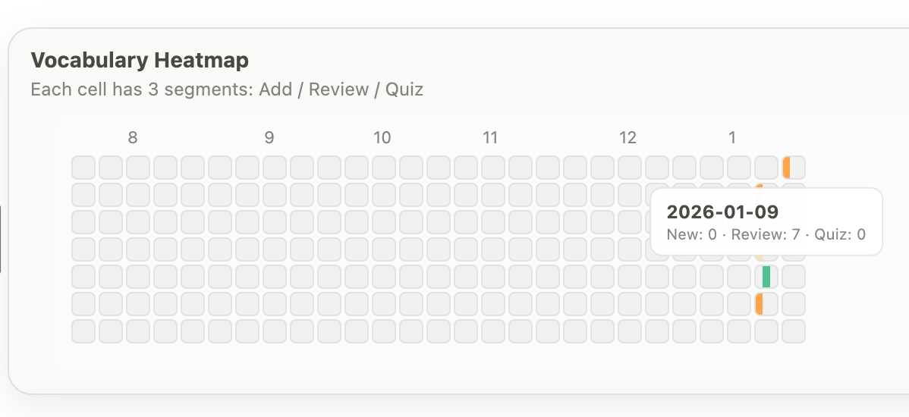

# 📊 词汇学习热力图（Vocabulary Learning Heatmap）
[English](README.md) | 中文说明

这是一个用于展示**每日词汇学习活动**的可视化仪表盘，灵感来自 GitHub 的贡献热力图。

该 Heatmap 主要面向 **基于 Notion 的词汇学习系统**，用于快速了解学习的连续性与节奏，而非单次学习量。

---

## 🎨 效果预览

| 浅色模式 | 深色模式 |
|---------|---------|
|  |  |

---

### 🔍 悬浮查看每日详情

  

Heatmap 中的每一个格子都支持悬浮查看详细信息。

当鼠标悬停在某一天上时，会显示：
- 日期
- 当天新增单词数量
- 当天复习次数
- 当天 Quiz 次数

在保持整体界面简洁的前提下，可以随时查看具体学习数据，而不会造成视觉干扰。

---

## ✨ Heatmap 展示什么？

每一个格子代表 **一天的学习活动**。

每个格子被分为三段：

- **左段**：新增单词（Add）
- **中段**：复习单词（Review）
- **右段**：Quiz / 做题次数（Quiz）

> 每格 3 段：Add · Review · Quiz

颜色深浅用于反映当天学习活动的相对强度，而非精确数量。

---

## 🧠 为什么使用热力图？

这个可视化方式主要用于：

- 帮助你觉察每日学习是否保持连续
- 快速识别学习的节奏与中断点
- 将注意力放在 **持续性** 而不是单日学习量
- 减少因“学得不够多”带来的焦虑感

目标并不是让热力图“越满越好”，  
而是建立一个**可长期维持的学习节奏**。

---

## 🔗 数据来源

Heatmap 所使用的数据来自一个由 **Notion 自动导出的 JSON 文件**。

数据通常包括：
- 每日新增单词数量
- 每日复习行为次数
- 每日 Quiz 次数

该数据文件通过 **GitHub Actions** 定期自动更新，无需人工干预。

---

## 🖥️ 使用方式

Heatmap 适用于以下场景：

- 嵌入到 **Notion 页面**，作为学习仪表盘组件
- 在 GitHub README 中展示学习系统
- 作为个人学习系统的轻量级可视化反馈

页面为纯静态网页，通过 **GitHub Pages** 部署。

---

## 🎨 设计说明

- 自动支持浅色 / 深色模式
- 配色参考 Notion UI，低饱和、不刺激
- 设计目标为「安静、清晰、不干扰」
- 适合长期打开、作为背景式反馈存在

---

### 🌗 深色 / 浅色模式

Heatmap 会根据 **系统主题自动切换显示模式**：

- 跟随系统级浅色 / 深色设置
- 无需手动切换
- 与 Notion 与操作系统界面保持一致

这种设计可以减少视觉摩擦，让 Heatmap 更自然地融入日常使用环境。

---

## 🧩 设计理念

- **可视化反馈 > 冷冰冰的数字**
- **每天出现 > 每天用力**
- **进度感知 > 绩效评估**

这是一个为长期学习设计的工具，而不是用于短期冲刺或比较的系统。
